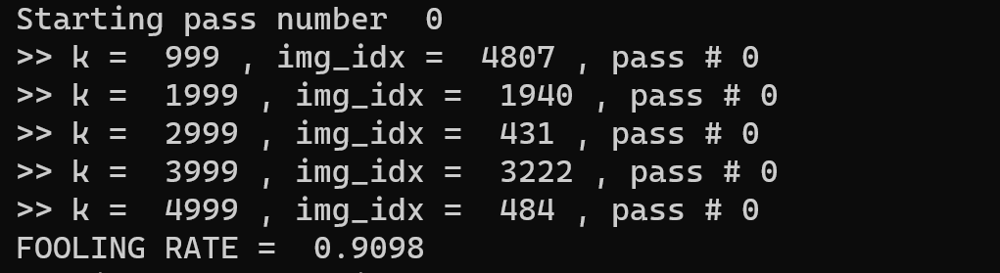
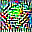
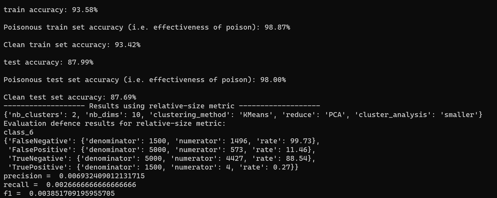

# AdvDoor: Adversarial Backdoor Attack of Deep Learning System
This is the repository for paper AdvDoor: Adversarial Backdoor Attack of Deep Learning System. 
We show the whole workflow of backdoor trigger generation, injection and detection.
## Usage
### Environments
We mainly use the tensorflow-gpu==1.10, keras==2.1.3, imageio, scikit-learn, matplotlib, and numpy==1.14.2, opencv-python. The CUDA version is==9.2 and the cudnn version is 7.6.4. We can also run the command to create an environment with anaconda.

 ``` bash
    conda create --name <env> python=3.6
    conda activate <env>
    conda install --file requirements.txt
    pip install opencv-python 
```

**Meanwhile, we need to ensure that the root path of project is the `src`.**

 ### Build Backdoor Trigger
 Run command to generate the backdoor trigger and train the poisoned model.

 ``` python test_specific_pair.py -c cifar.json -s 5 -t 6 -g ```

The generated trigger is saved at the `perturbation` dir. We should copy the file name and paste it to the item `pert_path` in `json/cifar.json`.

During generation, we need a benign model, if the `model_path` item in `json/cifar.json` is not valid, we will train a new benign model. Then, we can set the `model_path` item with the path of the newly trained model.

After generation, we will use it to train a backdoor model.

 ### Inject AdvDoor

If there is a trigger already, run the following command to train a poisoned model on it.

 ``` python test_specific_pair.py -c cifar.json -s 5 -t 6 ```

 Ensure that the `pert_path` in `json/cifar.json` is valid.

 During injection, we will finetune the backdoor model on a benign model, so we need to train a benign model first. If we already have a benign model, we could set the `model_path_finetune` item in `json/cifar.json` as its path.


### Evaluation
We will first generate the perturbation.
The fooling rate is shown below.
<div align=center></div>

The example of the generated trigger.

<div align=center></div>

In the following image, we can get the attack success rate, which is the 'Poisonous test set accuracy' in image. 
Meanwhile, we will try to detect the AdvDoor with Activation Clustering method [<sup>1</sup>](#activation_clustering). We can find that the f1-score is very low, which means that Activation Clustering can hardly find the poisoned data.

<div align=center></div>


### Section5.4.2 Crossing Model Attacks

#### ResNet to VGGNet, TUAP-Deepfool


#### ResNet to VGGNet, TUAP-C\&W


#### VGGNet to ResNet, TUAP-Deepfool


#### VGGNet to ResNet, TUAP-C\&W


### Reference

<div id="activation_clustering"></div>
- [1] Bryant Chen, Wilka Carvalho, Nathalie aracaldo, Heiko Ludwig, Benjamin Edwards, Taesung Lee, Ian Molloy, Biplav Srivastava: Detecting Backdoor Attacks on Deep Neural Networks by Activation Clustering. SafeAI@AAAI 2019


### Contacts
Quan Zhang zhangq20@mails.tsinghua.edu.cn
